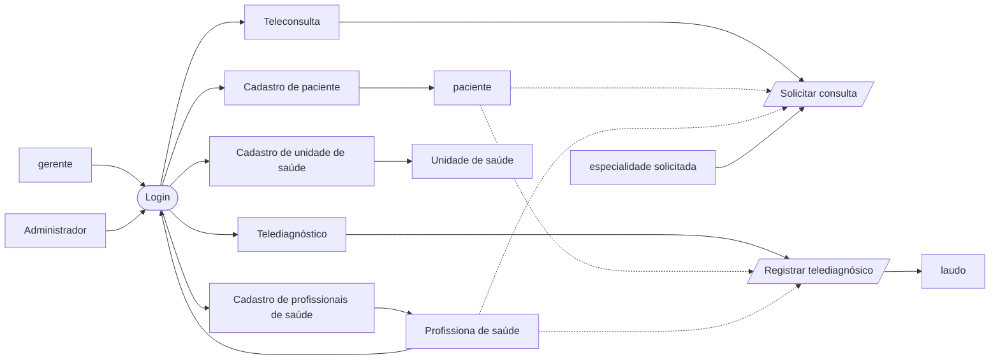
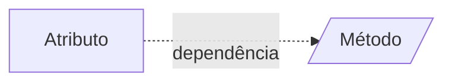
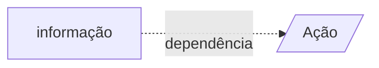
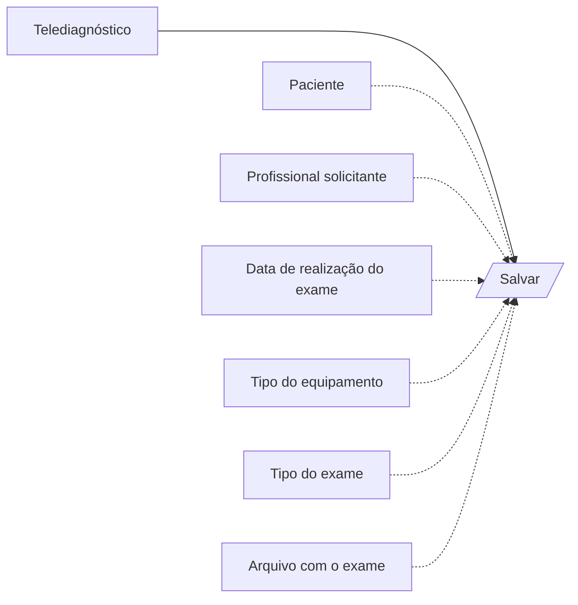
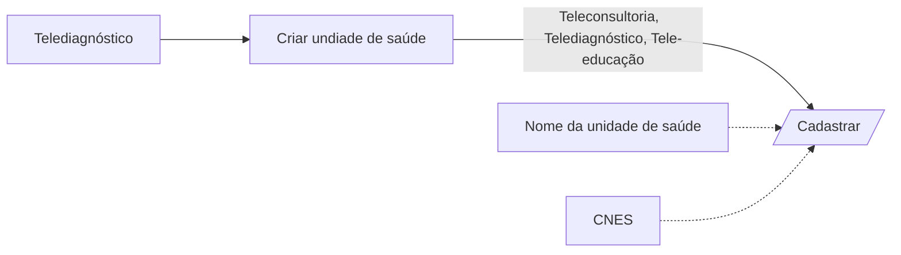
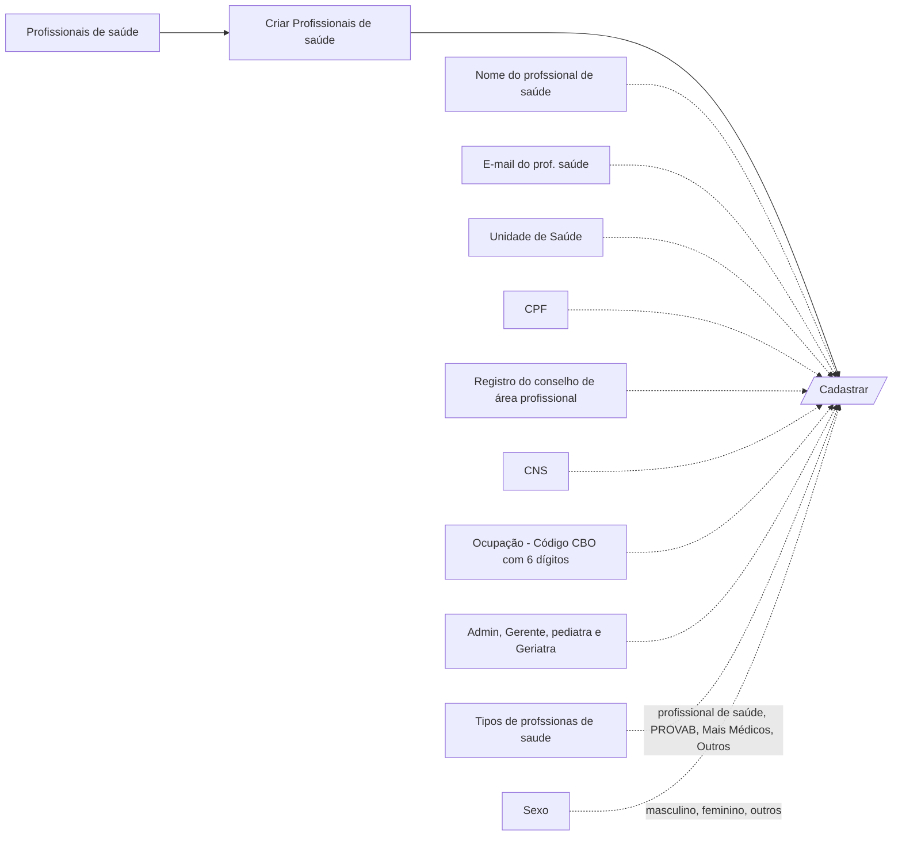
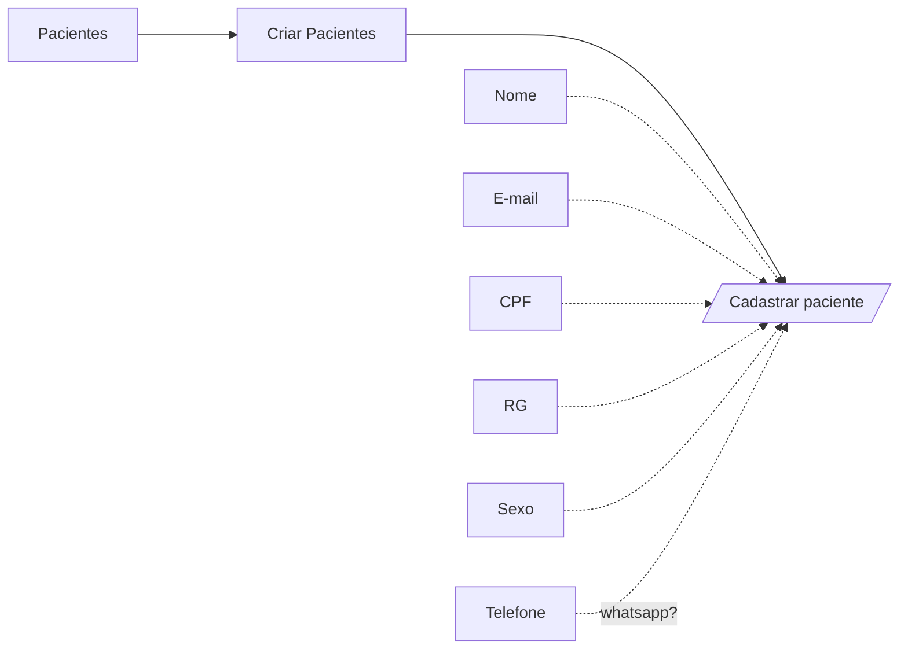

# Fluxo Geral de funcionalidades Telessaude

 
 

---

# Fluxo de consulta médica

 
 

---

# Fluxo de Telediagnóstico

 
 

---

# Fluxo de cadastro e unidades de saúde

 
 

---

# Fluxo de cadastro de profissionais de saúde

 
 

---

# Fluxo de cadastro de paciente

