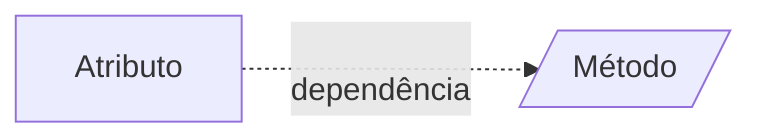
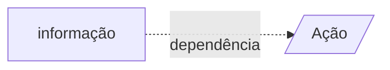
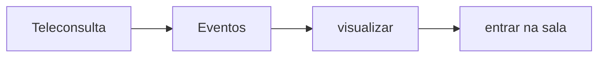
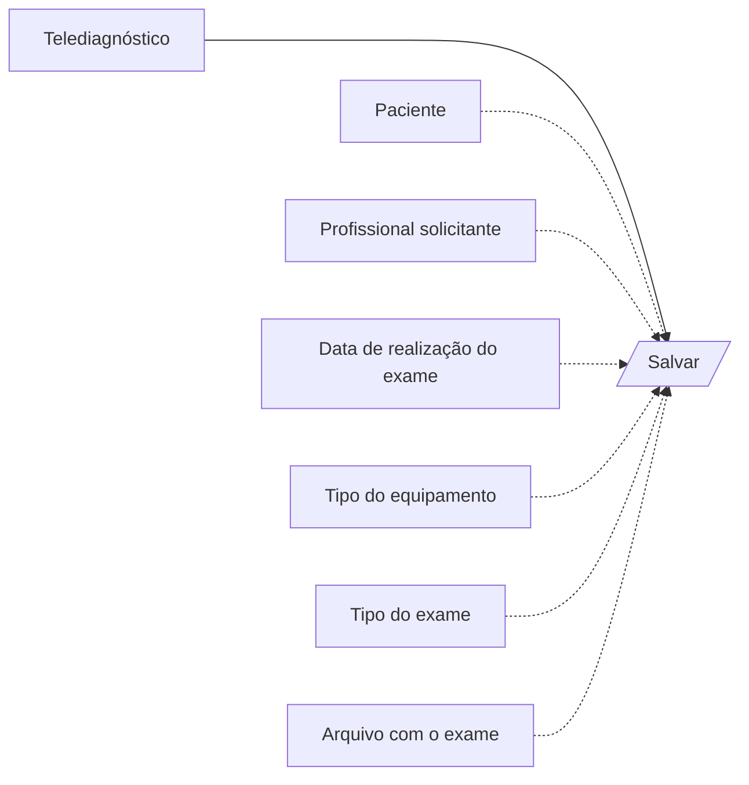
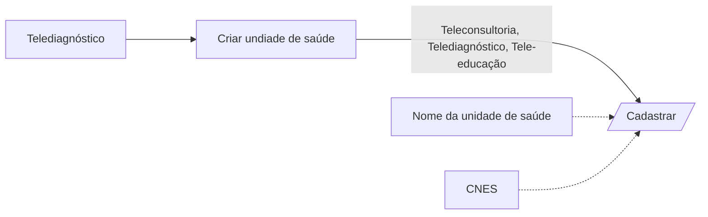

```mermaid
  
  graph LR;
      Login([Login])

      Gerente[gerente] --> Login;
      %% linkStyle 0 stroke: blue; colorir a seta
      ps["Profssinal de saude"] --> Login;
      Admin[Administrador] --> Login;
      Login--> teleconsulta[Teleconsulta];
      Login--> cp[Cadastro de paciente];
      cp --> paciente[paciente];
      Login--> cps[Cadastro de profissionais de saúde];
      cps --> ps[Profissiona de saúde];
      Login--> cus[Cadastro de unidade de saúde];
      cus --> us[Unidade de saúde];
      Login--> Diagnostico[Telediagnóstico];
      teleconsulta ----> sc[/"Solicitar consulta"/];
      paciente -..-> sc;
      ps -..-> sc;
      especialidade[especialidade solicitada] --> sc;
      Diagnostico ----> telediagnostico[/"Registrar telediagnósico"/];

      paciente -..->telediagnostico;
      ps -..-> telediagnostico;

      telediagnostico --> laudo ;


```

```mermaid
  
  graph LR;

  Dependência[Atributo] -.-> |" \n dependência  "| saida[/"Método"/];


```

```mermaid
  
  graph LR;

  Dependência[informação] -.-> |" \n dependência  "| saida[/"Ação"/];


```

 
 

---

# Fluxo de consulta médica

```mermaid
  
  graph LR;

  Consulta[Teleconsulta] --> eventos["Eventos"];
  eventos --> visualizar[visualizar];
  visualizar --> entrar_na_sala[entrar na sala];


```

 
 

---

# Fluxo de Telediagnóstico

```mermaid
  
  graph LR;

  Consulta[Telediagnóstico] ---> Salvar[/"Salvar"/];
  Paciente -.-> Salvar;
  ProfissionalSolicitante[Profissional solicitante] -.-> Salvar;
  data[Data de realização do exame] -.-> Salvar;
  equipamento[Tipo do equipamento] -.-> Salvar;
  exame[Tipo do exame] -.-> Salvar;
  arquivo[Arquivo com o exame] -.-> Salvar;


```

 
 

---

# Fluxo de cadastro e unidades de saúde

```mermaid
  
  graph LR;

  UnidadesDeSaúde[Telediagnóstico] ---> CriarUnidadeSaude["Criar undiade de saúde"];
  CriarUnidadeSaude ---> | \n Teleconsultoria,  Telediagnóstico, Tele-educação | Cadastrar[/"Cadastrar"/];
  NomeUnidadeSaude[Nome da unidade de saúde] -.-> Cadastrar;
  CNES -.-> Cadastrar;
```
